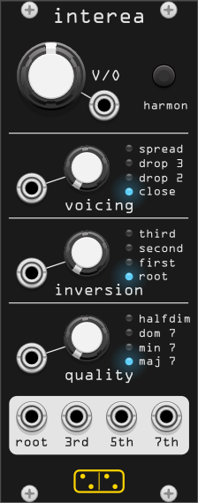

# forsitan modulare

A collection of VCV Rack modules

- [alea](#alea) - Add a random module to your rack
- [interea](#interea) - Make a chord from a V/Oct input, with quality, voicing and inversion. Harmonize option.
- [cumuli](#cumuli) - Accumulator with up and down gates and rates.
- [deinde](#deinde) - Quad cascading addressable attack-hold envelope.

## alea

*alea* adds a single random module to your rack, chosen from your entire library. Inspired by [WhatTheRack from korfuri](https://github.com/korfuri/WhatTheRack).

### how to use

Click on the ⚂ (die)

## interea

*interea* transform a V/Oct signal into a chord. It has four chord qualities (Maj7, Min7, Dom7, Half Dim), four inversions (root, first, second, third) and four voicings (close, drop 2, drop 3, spread). When the *harmonize* button is pressed, the frequency input is treated as a bassline and the chord is harmonized with the major scale. This module is inspired by [Strum's Mental Chord](https://github.com/Strum/Strums_Mental_VCV_Modules/wiki/Chord) and the physical module [Chord v1 by Qu-Bit Electronix](https://www.modulargrid.net/e/qu-bit-electronix-chord).

### how to use

Connect the four outputs to the V/O input of four oscillators. You shoud now be listening to the classic C4 Major7 chord. Play with the *frequency*, *quality*, *inversion* and *voicing* knobs and inputs to play different chord. The *frequency* input is bipolar (+/- 5V), the range of the other inputs is unipolar (0-10V). When the *harmonize* button is on, the chord *quality* is chosen automatically and the *quality* knob and input are disabled. In this state the notes of the chord will be harmonized with diatonic and modal interchange chords of the Major scale. See the [manual](https://www.qubitelectronix.com/s/Chord_Manual.pdf) for Qu-Bit Electronix Chord for addition explanations.

## cumuli

*cumuli* is an accumulator. The value accumulated grows when the *up* gate is open and grows to the rate indicated by the *up* knob. Simmetrically, the value decrease when the *down* gate is open, with a velocity specified by the *down* knob. The output value cannot go below 0V and over 10V, and holds its value when neither the *up* or *down* gates are open. The *up* and *down* knobs are exponential, and their values range between 0.01 V/sec and 100 V/sec (1 V/sec default).

### how to use

Connect two gate signals to the *up* and *down* input, select the *up* and *down* rate with the respective knobs and watch the output go up, down or hold. This module was imagined as a companion to midi controllers like the [Korg nanoPAD2](https://www.korg.com/us/products/computergear/nanopad2/), which has no faders, only buttons.

## deinde

*deinde* is a quad cascading addressable attack-hold envelope.

- quad: because it outputs 4 envelopes
- cascading: because the 4 envelopes open one after the other
- addressable: because the envelopes can be scanned with the *cascade* knob and CV
- attack-hold envelope: because every envelope has a linear attack and then stays open

This module is inspired by [A-144 by Doepfer](http://www.doepfer.de/a144.htm), with a significative difference: the four envelopes of the A-144 are attack-decay, while in this module they are attack-hold. One of the initial ideas behind this module was opening four send effects with only one control signal, for example: volume ramp, then saturation, then distortion, then fuzz.

### how to use

Connect the four output as you would for four envelopes, for example to the vca of four oscillators tuned to a chord. Turn the *cascade* knob to open the four envelope in sequence. When there is a signal in the *CV in* input, the signal scan the envelopes like the *cascade* knob, and in that case the *CV* knob acts like an attenuator and the *cascade* knob like an offset. All inputs and outputs are 0V-10V.

## Author

Giampaolo Guiducci <giampaolo.guiducci@gmail.com>

## License

GPL-3
